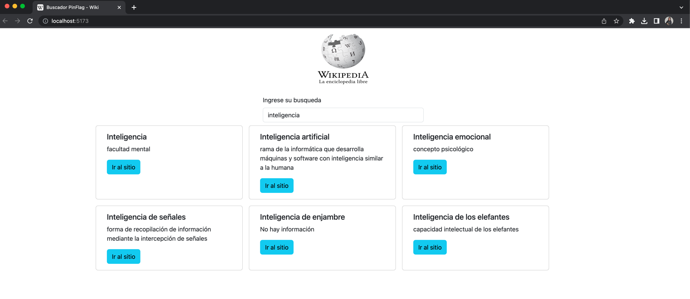
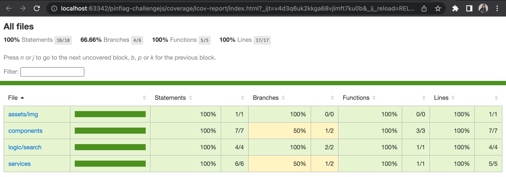

# Proyecto de Challenge Frontend Javascript Pinflag

Este proyecto fue realizado con Javascript, Axios, Bootstrap y Vite.

### Funcionamiento
Para levantar esta aplicación se requiere hacerlo con NPM el comando es el siguiente:
```
npm run dev
```
El sitio web se levantará en el **http://localhost:5173** sino se tiene ocupado con otro servicio

Una vez en el sitio, se podrá visualizar un input para hacer las busquedas que queramos en Wikipedia,
cada una de las cards que se muestran son solo relacionadas con la palabra clave de busqueda, esto depende
directamente de la API de Wikipedia, en cada una de las cards tenemos un botón que nos lleva a la web de Wikipedia
sin sacarnos del buscador para poder seguir haciendo busquedas sin problemas.

**Se debe tomar en consideración que el buscador solo funciona cuando se empieza a escribir la tercera letra**,
se hizo de esta forma para no abusar de la API de Wikipedia, ya que es una API totalmente libre.



### Testing y resultados de Coverage



### Problemas que hubo y como se solucionaron

Uno de los problemas que hubo con la API de Wikipedia es que no existe como tal una URL hacia la web de la busqueda
a pesar de que la documentación indica otra cosa, como el agregar parametros que no dieron el resultado esperado, 
pero se pudo apreciar que efectivamente la propiedad **key** dentro de la respuesta JSON, concatenando con la URL de
Wikipedia nos lleva directamente a la web sin problema.

### Palabras finales

Me gustaría agradecer por el desafío, ya que siempre se aprenden cosas nuevas y como solucionarlas sin contratiempos, 
cualquier duda sobre este código estoy atenta a su disposición.

Sigamos haciendo magia!!!


